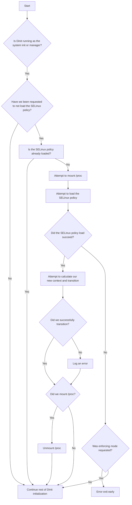

# Dinit SELinux Awareness

Dinit has support for basic SELinux awareness. This document is intended to outline the extent and
inner workings of Dinit's SELinux awareness. The reader is assumed to be knowledgeable about the
basics of [SELinux](https://github.com/SELinuxProject/selinux-notebook) and Dinit.

Dinit needs to be built with SELinux support (see [BUILD](/BUILD)) to enable the features that are
mentioned in this document.

## Loading the system SELinux policy
When running as the system init or manager, Dinit by default will attempt to load the system's
SELinux policy and transition itself to a context specified by that policy if not already done so.
This behaviour may be disabled by passing the `--disable-selinux-policy` command-line argument to
`dinit`.

If not already mounted earlier in the boot process (e.g. by an initramfs), Dinit will instruct the
SELinux framework to mount sysfs (typically `/sys`), and selinuxfs (typically `/sys/fs/selinux`) in
order to load the policy. Should the mounting of either fail, the policy load may fail. In addition,
Dinit itself will also temporarily mount `/proc`, and the newly mounted procfs will be mounted over
an existing procfs. In order for this, and as such the initial setup of SELinux, to succeed, the
`/proc` directory will need to exist. This occurs before any services are started.

Dependent on the requested loading state of SELinux, Dinit has different behaviour should policy
load fail. If SELinux was requested to be loaded in Enforcing mode and the policy load failed,
Dinit will bail early after printing an error to stderr. If SELinux was requested to be loaded in
Permissive mode and the policy load failed, Dinit will buffer a message to be logged via Dinit's
logging facilities once they have been initalised. Regardless of the requested loading state of
SELinux, Dinit will always buffer a log message should transitioning itself to the correct
context fail. Failure to transition will not result in Dinit bailing as the policy previously
loaded may prevent Dinit from being able to do so.

The following flowchart provides an overview of the process of loading the policy:

