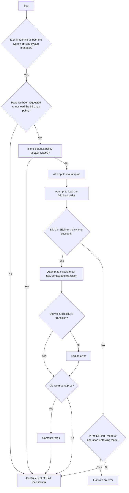

# Dinit SELinux Support

Dinit has support for loading the SELinux security policy at boot time, which must be enabled at
build time (see [BUILD](/BUILD)). This document outlines how to use this support, including the
requirements and potential system effects. The reader is assumed to be knowledgeable about the
basics of [SELinux](https://github.com/SELinuxProject/selinux-notebook) and Dinit.

## Loading the system SELinux policy
When running as both the system init and system manager, Dinit by default will attempt to load the
system's SELinux policy and transition itself to a context specified by that policy if not already
done so. This behaviour may be disabled by passing the `--disable-selinux-policy` command line
argument to `dinit`.

If not already mounted earlier in the boot process (e.g., by an initramfs), Dinit will instruct the
SELinux framework to mount sysfs (typically `/sys`), and selinuxfs (typically `/sys/fs/selinux`) in
order to load the policy. Should the mounting of either fail, the policy load may fail. In addition,
Dinit itself will also temporarily mount `/proc`, and the newly mounted procfs will be mounted over
an existing procfs. In order for this, and as such the initial setup of SELinux, to succeed, the
`/proc` directory will need to exist. This occurs before any services are started.

Dependent on the SELinux mode of operation, Dinit has different behaviour should policy load fail.
If the mode of operation is Enforcing mode and the policy load failed, Dinit will exit with an
error. If the mode of operation is Permissive mode and the policy load failed, Dinit will prepare a
message to be logged via Dinit's logging facilities once they have been initialised. Regardless of
the SELinux mode of operation, Dinit will log a warning should transitioning itself to the correct
context fail. Failure to transition will not result in Dinit exiting with an error; the policy that
was just loaded may prevent Dinit from being able to transition into a new context.

The following flowchart provides an overview of the process of loading the policy:

