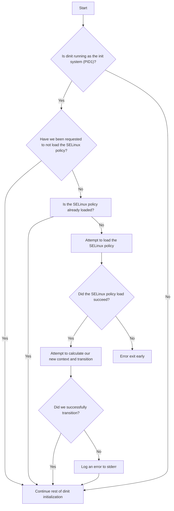

# Dinit SELinux Awareness

Dinit has support for basic SELinux awareness. This document is intended to
outline the extent and inner workings of dinit's SELinux awareness. The reader
is assumed to be knowledgeable about the basics of SELinux and dinit.

Dinit needs to be built with SELinux support to enable any of the features that
are mentioned in this document.

## Loading the system SELinux policy
When booted as the system init system, dinit by default will attempt to load the
system's SELinux policy and transition itself to a context specified by that policy
if not already done so in earlier boot (e.g. by an initramfs).

The following flowchart provides an overview of the process of loading the policy:

```mermaid
flowchart TD
    A[Start] --> B{"Is dinit running as the init system (PID1)?"}
    B -->|Yes| C{Have we been requested to not load the SELinux policy?}
    B -->|No| D[Continue rest of dinit initialization]
    C -->|Yes| D
    C -->|No| E[Is the SELinux policy already loaded?]
    E -->|Yes| D
    E -->|No| F[Attempt to load the SELinux policy]
    F --> G{Did the SELinux policy load succeed?}
    G -->|Yes| H[Attempt to calculate our new context and transition]
    G -->|No| I[Error exit early]
    H --> J{Did we successfully transition?}
    J -->|Yes| D
    J -->|No| L[Log an error to stderr]
    L --> D
```
